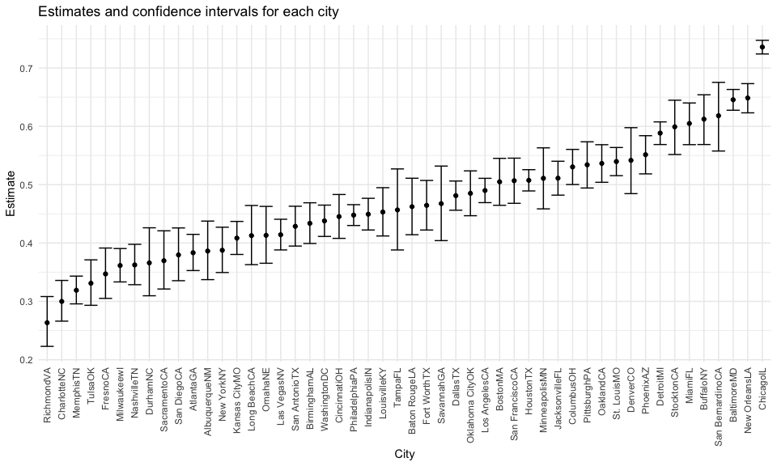
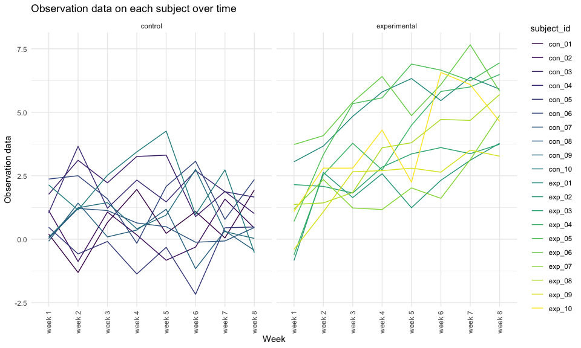

p8105\_hw5\_rr3423.Rmd
================
Ragyie Rawal

## PROBLEM 1

``` r
homicide_data = read_csv("data/homicide-data.csv", na = c("", "Unknown"))
```

    ## Rows: 52179 Columns: 12

    ## ── Column specification ────────────────────────────────────────────────────────
    ## Delimiter: ","
    ## chr (8): uid, victim_last, victim_first, victim_race, victim_sex, city, stat...
    ## dbl (4): reported_date, victim_age, lat, lon

    ## 
    ## ℹ Use `spec()` to retrieve the full column specification for this data.
    ## ℹ Specify the column types or set `show_col_types = FALSE` to quiet this message.

### Describing raw data

``` r
homicide_variable = 
  homicide_data %>% 
  names()

homicide_columns = 
  homicide_data %>% 
  ncol()

homicide_rows = 
  homicide_data %>% 
  nrow()
```

The **key variables** in the raw homicide dataset are uid,
reported\_date, victim\_last, victim\_first, victim\_race, victim\_age,
victim\_sex, city, state, lat, lon, disposition. The **number of
columns** in the raw homicide dataset are 12. The **number of rows** in
the raw homicide dataset are 52179. There is data provided for a total
of **52179 homicides** from 50 large U.S. cities. The raw dataset
contained “Unknown” and blank data values, which I replaced with “NA”
values when importing the csv file.

### Creating city-state and resolution variables

``` r
homicide_df = 
  homicide_data %>%
  mutate(
    city_state = str_c(city, state),
    resolution = case_when(
      disposition == "Closed without arrest" ~ "unsolved",
      disposition == "Open/No arrest" ~ "unsolved",
      disposition == "Closed by arrest" ~ "solved"
    )) %>% 
  relocate(city_state) %>% 
  filter(city_state != "TulsaAL")
```

### Summary of the total number of homicides and the number of unsolved homicides within cities

``` r
# summarizing total number of homicides within cities 
homicide_df %>% 
  group_by(city_state) %>% 
  summarize(
    unsolved = sum(resolution == "unsolved"), 
    total = n()
  ) %>% 
  knitr::kable(
    caption = "**Table 1: Total number of homicides and unsolved homicides within cities**")
```

| city\_state      | unsolved | total |
|:-----------------|---------:|------:|
| AlbuquerqueNM    |      146 |   378 |
| AtlantaGA        |      373 |   973 |
| BaltimoreMD      |     1825 |  2827 |
| Baton RougeLA    |      196 |   424 |
| BirminghamAL     |      347 |   800 |
| BostonMA         |      310 |   614 |
| BuffaloNY        |      319 |   521 |
| CharlotteNC      |      206 |   687 |
| ChicagoIL        |     4073 |  5535 |
| CincinnatiOH     |      309 |   694 |
| ColumbusOH       |      575 |  1084 |
| DallasTX         |      754 |  1567 |
| DenverCO         |      169 |   312 |
| DetroitMI        |     1482 |  2519 |
| DurhamNC         |      101 |   276 |
| Fort WorthTX     |      255 |   549 |
| FresnoCA         |      169 |   487 |
| HoustonTX        |     1493 |  2942 |
| IndianapolisIN   |      594 |  1322 |
| JacksonvilleFL   |      597 |  1168 |
| Kansas CityMO    |      486 |  1190 |
| Las VegasNV      |      572 |  1381 |
| Long BeachCA     |      156 |   378 |
| Los AngelesCA    |     1106 |  2257 |
| LouisvilleKY     |      261 |   576 |
| MemphisTN        |      483 |  1514 |
| MiamiFL          |      450 |   744 |
| MilwaukeewI      |      403 |  1115 |
| MinneapolisMN    |      187 |   366 |
| NashvilleTN      |      278 |   767 |
| New OrleansLA    |      930 |  1434 |
| New YorkNY       |      243 |   627 |
| OaklandCA        |      508 |   947 |
| Oklahoma CityOK  |      326 |   672 |
| OmahaNE          |      169 |   409 |
| PhiladelphiaPA   |     1360 |  3037 |
| PhoenixAZ        |      504 |   914 |
| PittsburghPA     |      337 |   631 |
| RichmondVA       |      113 |   429 |
| SacramentoCA     |      139 |   376 |
| San AntonioTX    |      357 |   833 |
| San BernardinoCA |      170 |   275 |
| San DiegoCA      |      175 |   461 |
| San FranciscoCA  |      336 |   663 |
| SavannahGA       |      115 |   246 |
| St. LouisMO      |      905 |  1677 |
| StocktonCA       |      266 |   444 |
| TampaFL          |       95 |   208 |
| TulsaOK          |      193 |   583 |
| WashingtonDC     |      589 |  1345 |

**Table 1: Total number of homicides and unsolved homicides within
cities**

### Focusing on Baltimore, MD

``` r
baltimore_df = 
  homicide_df %>% 
  filter(city_state == "BaltimoreMD")

baltimore_summary = 
  baltimore_df %>% 
  summarize(
    unsolved = sum(resolution == "unsolved"),
    n = n()
  )

# prop.test to estimate proportion of unsolved homicides in baltimore 
baltimore_test = 
  prop.test(
  x = baltimore_summary %>% pull(unsolved),
  n = baltimore_summary %>% pull(n)
)

# applying broom::tidy
baltimore_test %>% 
  broom::tidy()
```

    ## # A tibble: 1 × 8
    ##   estimate statistic  p.value parameter conf.low conf.high method    alternative
    ##      <dbl>     <dbl>    <dbl>     <int>    <dbl>     <dbl> <chr>     <chr>      
    ## 1    0.646      239. 6.46e-54         1    0.628     0.663 1-sample… two.sided

From the resulting tidy dataframe, the estimated proportion is 0.646 and
the 95% confidence interval is (0.628, 0.663). This means that
approximately 64.6% of homicides in Baltimore are unsolved.

### Creating prop.test function

``` r
# creating a function 
prop_test_function = function(city_df) {
  
  city_summary = 
    city_df %>% 
    summarize(
      unsolved = sum(resolution == "unsolved"),
      n = n()
    )

  city_test = 
   prop.test(
    x = city_summary %>% pull(unsolved),
    n = city_summary %>% pull(n)
  )
  
  return(city_test)
  
}

# testing function on some cities
prop_test_function(baltimore_df)
```

    ## 
    ##  1-sample proportions test with continuity correction
    ## 
    ## data:  city_summary %>% pull(unsolved) out of city_summary %>% pull(n), null probability 0.5
    ## X-squared = 239.01, df = 1, p-value < 2.2e-16
    ## alternative hypothesis: true p is not equal to 0.5
    ## 95 percent confidence interval:
    ##  0.6275625 0.6631599
    ## sample estimates:
    ##         p 
    ## 0.6455607

``` r
homicide_df %>% 
  filter(city_state == "AlbuquerqueNM") %>% 
  prop_test_function
```

    ## 
    ##  1-sample proportions test with continuity correction
    ## 
    ## data:  city_summary %>% pull(unsolved) out of city_summary %>% pull(n), null probability 0.5
    ## X-squared = 19.114, df = 1, p-value = 1.232e-05
    ## alternative hypothesis: true p is not equal to 0.5
    ## 95 percent confidence interval:
    ##  0.3372604 0.4375766
    ## sample estimates:
    ##         p 
    ## 0.3862434

### Iterating across cities

``` r
# tidy dataframe with estimated proportions and CIs for each city 
results_df = 
  homicide_df %>% 
  nest(data = uid:resolution) %>%
  mutate(
    test_results = map(data, prop_test_function),
    tidy_results = map(test_results, broom::tidy)
  ) %>% 
  select(city_state, tidy_results) %>% 
  unnest(tidy_results) %>% 
  select(city_state, estimate, starts_with("conf"))
```

### Plot showing estimates and CIs for each city

``` r
results_df %>% 
  mutate(city_state = fct_reorder(city_state, estimate)) %>% 
  ggplot(aes(x = city_state, y = estimate)) +
  geom_point() +
  geom_errorbar(aes(ymin = conf.low, ymax = conf.high)) +
  theme(axis.text.x = element_text(angle = 90, vjust = 0.5, hjust = 1)) + 
  labs(
    title = "Estimates and confidence intervals for each city",
    x = "City", 
    y = "Estimate"
  )
```



## PROBLEM 2

### Creating a dataframe containing all file names using list.files

``` r
file_names_df = 
  tibble(
    file = list.files("data/zip_data/"))
```

### Iterating over file names

``` r
# creating iteration function 
file_iteration_function = function(file_name) {
  
  data = 
    read_csv(file = paste0("data/zip_data/", file_name))
  
}

# iterating over file names, saving result as new variable in dataframe
participants_df = 
  file_names_df %>% 
  mutate(
    weeks_data = map(file, file_iteration_function)
  ) %>% 
  unnest(weeks_data)
```

### Tidying dataframe

``` r
# tidying the resulting dataframe
tidy_participants_df = 
  participants_df %>%
  janitor::clean_names() %>% 
  mutate(
    study_arm = str_extract(file, "con|exp"),
    study_arm = case_when(
      study_arm == "con" ~ "control",
      study_arm == "exp" ~ "experimental"), 
    subject_id = str_replace(file, ".csv", "")
  ) %>% 
  select(-file) %>% 
  relocate(subject_id, study_arm, everything()) %>% 
  pivot_longer(
    week_1:week_8,
    names_to = "week",
    values_to = "observation_data"
  ) %>% 
  mutate(
    week = factor(week,levels = c("week_1", "week_2", "week_3", "week_4",
                                  "week_5", "week_6", "week_7", "week_8"))
  )
```

### Creating spaghetti plot showing observations on each subject over time

``` r
tidy_participants_df %>% 
  ggplot(aes(x = week, y = observation_data, color = subject_id)) + 
  geom_line(aes(group = subject_id)) + 
  facet_grid(.~ study_arm) +
  labs(
    title = "Observation data on each subject over time",
    x = "Week", 
    y = "Observation data"
  ) + 
  theme(legend.position = "right") 
```



The observation data for experimental subjects over time is higher than
the observation data for control subjects over time. The observation
data for experimental subjects generally increases over time, while the
observation data for control subjects appears to stay relatively stable
over time.

## PROBLEM 3

### Loading the iris dataset

``` r
library(tidyverse)

set.seed(10)

iris_with_missing = iris %>% 
  map_df(~replace(.x, sample(1:150, 20), NA)) %>%
  mutate(Species = as.character(Species))
```

### Writing function for missing values

``` r
iris_missing_function = function(vector) {
  
  if (is.numeric(vector)) {
    vector[is.na(vector)] = mean(vector, na.rm = TRUE)
    message(mean(vector, na.rm = TRUE))
  }
  
  if (is.character(vector)) {
    vecotr[is.na(vector)] = "virginica"
  }
  
  return(vector)
  
}


# map across all of the columns after this function 
```
